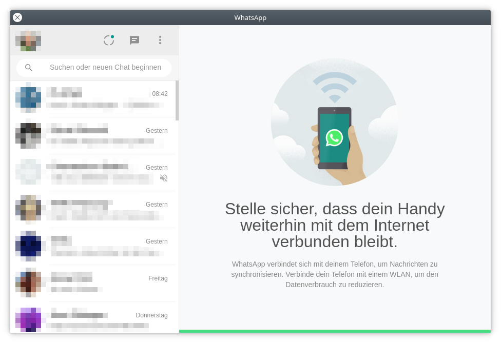

# WhatsAppQT

Unofficial WhatsApp Web Desktop Client.

Attribution: Icon by Teguh Sulistio https://www.iconfinder.com/VISOEALE

## Flatpak config

The flatpak config file can be found in the [flathub/io.bit3.WhatsAppQT](https://github.com/flathub/io.bit3.WhatsAppQT/blob/master/io.bit3.WhatsAppQT.yml) repository.

## Tweaks

### Allow uploading files from everywhere in /home/user

Per default the app is only allowed to access the "downloads" folder, to make it possible to download files and upload from "downloads" folder.

That may be too restrictive for most. To grant access to your home directory, override filesystem access with:

    flatpak override --filesystem=home io.bit3.WhatsAppQT

## Local development

### Installing dependencies

It is recommend to use the *flatpak user mode* installation method.
In this mode the packages are installed into user space, without affecting the system.

#### flatpak user mode

Add Flathub remote:

    flatpak remote-add --user --if-not-exists flathub https://flathub.org/repo/flathub.flatpakrepo

Install required packages:

    flatpak install --user --assumeyes flathub org.kde.Platform//5.15 org.kde.Sdk//5.15 io.qt.qtwebengine.BaseApp//5.15

#### flatpak system mode

    sudo flatpak remote-add --if-not-exists flathub https://flathub.org/repo/flathub.flatpakrepo

    sudo flatpak install --assumeyes flathub org.kde.Platform//5.15 org.kde.Sdk//5.15 io.qt.qtwebengine.BaseApp//5.15

#### qt5 packages

For local code completion / assistance. Not needed for compiling!

    sudo dnf install qt5-qtwebengine-devel

NOTE: In the Clion IDE it is necessary to define the `CMAKE_PREFIX_PATH` in the _CMake options_
      (_Settings - Build, Execution, Development - CMake_), e.g. `-DCMAKE_PREFIX_PATH=/usr/lib64/qt5` on fedora.
      (link:https://www.jetbrains.com/help/clion/qt-tutorial.html#configure-cmakelists[ref])

### Building and running the application

Navigate to the correct directory:

    cd /path/to/whatsappqt

Build the applications:

    flatpak-builder --user --force-clean --install-deps-from=flathub build-dir io.bit3.WhatsAppQT.yml

Run the application:

    flatpak-builder --run build-dir io.bit3.WhatsAppQT.yml WhatsAppQT

